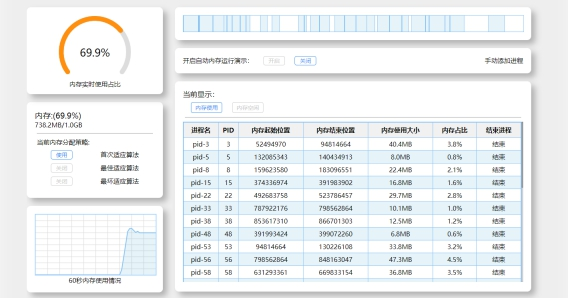
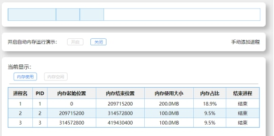
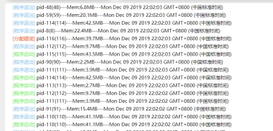
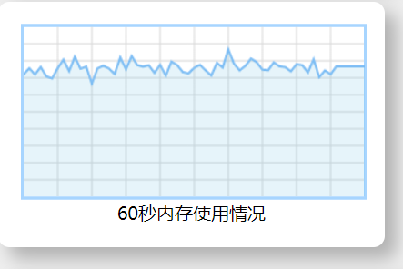

# 内存管理实验

## 一. 实验目的及实验环境

实验目的：

1. 通过观察、分析实验现象，深入理解内存空间分配与回收等方面的特点，掌握首次适应、最佳适应、最坏适应三种内存分配策略。

2. 掌握内存回收过程实现思路。

实验环境：

1. 硬件
     (1) 主机：Pentium III 以上；
     (2) 内存：128MB 以上；
     (3) 显示器：VGA 或更高；
     (4) 硬盘空间：至少100MB 以上剩余空间。
2. 软件
     window10 操作系统，chrome浏览器

## 二. 实验内容

​	使用软件模拟计算机的内存，以及进程内存分配调度的情况。要求使用三种分配方式，进行内存分配。实时显示内存中所有正在运行程序的内存和内存碎片的相关信息，并输出进程分配与回收的日志。

## 三．方案设计

​	整个演示程序，使用web前端开发，具有较好的交互界面。在设计上使用发布订阅的设计模式，使用MVVM思想驱动页面渲染。整个页面全部使用模块化开发，具有较高的扩展和维护性。

​	在内存分配算法：实现方面使用模版方法的设计模式，首先根据当前程序所选择的分配策略对内存空闲分区进行排序，之后按照排序的结果选择最先满足条件的空闲内存分区，进行分配。

三种分配方式：

1. 首次适应算法（first-fit）：从空闲分区表的第一个表目起查找该表，把最先能够满足要求的空闲区分配给作业，这种方法的目的在于减少查找时间。

2. 最佳适应算法（best-fit）：从全部空闲区中找出能满足作业要求的，且大小最小的空闲分区，这种方法能使碎片尽量小。

3. 最差适应算法（worst-fit）：它从全部空闲区中找出能满足作业要求的、且大小最大的空闲分区，从而使链表中的节点大小趋于均匀。

 

​	在内存回收算法：首先根据当前进程所占用内存的起始和结束的内存标尺，找出当前空间的前后两个内存空间，然后分为四种情况进行处理：

1. 前后都空闲：两个空闲分析合为一个分区，起点：前分区的开头，终点：后分区的结尾

2. 前后都占用：插入一个新的分区，起点：释放内存的开头，终点：释放内存的结尾

3. 前空闲，后占用：前分区与释放内存合并，起点：前分区开头，终点：释放内存结尾

l 前占用，后空闲：后分区与释放内存合并，起点：释放内存开头，终点：后分区结尾

## 四．测试数据及运行结果

 

## 五．总结

 	在本次实验中，基本掌握了内存分配与回收的过程，体会不同分配算法的差别。同时使用面向对象的模块化思想，结合设计模式，进行程序的设计与开发，感觉收获较多。

​	本次实验主要是使用软件模拟内存分配的过程，算法实现上不是很难，但是真正的内存分配，是很复杂的，期间涉及到了很多的方面的知识。还是需要再深入学习一下。